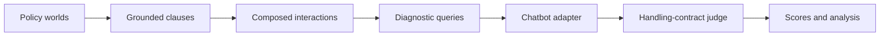

<div align="center">

# COPAL

### A framework and paper artifact release for composed-policy chatbot evaluation

[](https://github.com/BruceAllenCS/COPAL-code/actions/workflows/ci.yml)
[](pyproject.toml)
[](LICENSE)
[](datasets/copal-paper-v1)

**COPAL turns organizational policies into diagnostic composed-policy probes, runs them against any chatbot adapter, and judges whether the response satisfies the expected handling contract.**

[Quick Start](#quick-start) | [Use Your Chatbot](#use-copal-with-your-chatbot) | [Paper Dataset](#paper-reproducibility-dataset) | [Artifacts](#released-paper-artifacts) | [Citation](#citation)

</div>

---

## Why COPAL?

Real deployed chatbots rarely face one policy rule at a time. A user request may simultaneously trigger verification gates, scope restrictions, selective disclosure requirements, and workflow-transfer obligations. COPAL is built to test exactly those non-separable cases.

COPAL provides:

| Capability | What it gives you |
| --- | --- |
| Clause grounding | Converts raw policy rules into grounded `trigger`, `scope`, and `effect` clauses. |
| Policy composition | Finds interacting clauses that jointly constrain one response boundary or workflow path. |
| Diagnostic query generation | Builds composed-policy probes targeting concrete failure facets. |
| Chatbot adapters | Tests HTTP endpoints, command-line bots, or imported JSONL responses. |
| Contract-based judging | Scores responses against required obligations and forbidden handling outcomes. |
| Paper release | Ships the full synthetic policy inventory plus final experiment artifacts. |

## How It Works



The framework path is the main public interface. The paper-specific scripts and artifacts are included so readers can reproduce, inspect, and audit the reported experiments.

## Quick Start

The smoke test below uses the included demo policy and a local mock chatbot. It does **not** call external LLM APIs.

```bash
python3.12 -m venv .venv
source .venv/bin/activate
python -m pip install -U pip
python -m pip install -e ".[dev]"
```

```bash
python scripts/run_copal_framework.py construct \
  --workspace-key demo-support \
  --run-id demo_framework \
  --policies-path examples/policy_worlds.jsonl \
  --prompts-path examples/system_prompts.jsonl \
  --runs-dir runs_framework \
  --execution-mode deterministic \
  --composition-limit-per-signature 1

python scripts/run_copal_framework.py probe-command \
  --run-dir runs_framework/demo_framework \
  --command "python examples/mock_chatbot.py" \
  --bot-id demo-mock \
  --live-max-workers 2

python scripts/run_copal_framework.py judge \
  --run-dir runs_framework/demo_framework \
  --execution-mode deterministic
```

Expected outputs:

| File | Purpose |
| --- | --- |
| `runs_framework/demo_framework/selection/benchmark_items_final.jsonl` | Generated composed-policy probes. |
| `runs_framework/demo_framework/evaluation/chatbot_requests.jsonl` | Requests sent to the chatbot adapter. |
| `runs_framework/demo_framework/evaluation/chatbot_responses.jsonl` | Target chatbot responses. |
| `runs_framework/demo_framework/evaluation/response_judgments.jsonl` | Response-level correctness labels. |
| `runs_framework/demo_framework/evaluation/evaluation_summary.json` | Aggregate score and error summary. |

## Use COPAL With Your Chatbot

COPAL is adapter-first. Your chatbot only needs to receive a query and return response text.

### 1. Prepare policy inputs

Use the demo files as schema examples:

- `examples/policy_worlds.jsonl`
- `examples/system_prompts.jsonl`

### 2. Construct probes

```bash
python scripts/run_copal_framework.py construct \
  --workspace-key your-workspace \
  --run-id your_run \
  --policies-path path/to/policy_worlds.jsonl \
  --prompts-path path/to/system_prompts.jsonl \
  --runs-dir runs_framework \
  --execution-mode live \
  --all-roles-model gpt-5.5 \
  --live-max-workers 8
```

### 3. Probe a chatbot

HTTP endpoint:

```bash
python scripts/run_copal_framework.py probe-http \
  --run-dir runs_framework/your_run \
  --endpoint http://localhost:8000/chat \
  --response-json-key response_text \
  --bot-id my-chatbot \
  --live-max-workers 16
```

Command-line adapter:

```bash
python scripts/run_copal_framework.py probe-command \
  --run-dir runs_framework/your_run \
  --command "python path/to/your_bot.py" \
  --bot-id my-chatbot
```

Imported responses:

```bash
python scripts/run_copal_framework.py import-responses \
  --run-dir runs_framework/your_run \
  --responses-path path/to/chatbot_responses.jsonl \
  --bot-id my-chatbot
```

The imported JSONL must contain:

```json
{"item_id": "probe-id", "response_text": "chatbot answer"}
```

### 4. Judge responses

```bash
python scripts/run_copal_framework.py judge \
  --run-dir runs_framework/your_run \
  --execution-mode live \
  --judge-model gemini-3-flash-preview \
  --live-max-workers 16
```

For input schemas and adapter contracts, see [`docs/FRAMEWORK.md`](docs/FRAMEWORK.md).

## Live LLM Configuration

For live construction and response judging, configure an OpenRouter-compatible route explicitly:

```bash
export COPAL_LIVE_PROVIDER=openrouter
export COPAL_OPENROUTER_API_KEY="your-key"
export COPAL_OPENROUTER_RESPONSE_FORMAT=json_object
export COPAL_OPENROUTER_MODEL_MAP='{
  "gpt-5.5": "provider/model-id-for-gpt-5.5",
  "gemini-3-flash-preview": "provider/model-id-for-json-judge"
}'
```

Do not commit local key files.

## Paper Reproducibility Dataset

The paper input dataset is committed under [`datasets/copal-paper-v1/`](datasets/copal-paper-v1/).

| Released data | Count |
| --- | ---: |
| Industries | 30 |
| Synthetic company policy worlds | 300 |
| Deployment system prompts | 300 |
| Policy rules | 8,857 |
| Allowed policy rules | 4,357 |
| Prohibited policy rules | 4,500 |

Regenerate the base dataset:

```bash
python scripts/export_paper_dataset.py
```

## Released Paper Artifacts

The curated final experiment bundle lives in [`datasets/copal-paper-v1/artifacts/`](datasets/copal-paper-v1/artifacts/).

| Artifact family | Count |
| --- | ---: |
| Final paper company-world specs | 30 |
| Grounded clauses | 480 |
| Accepted composition records | 232 |
| Generated candidate queries | 3,827 |
| Screening / mapping log records | 4,343 |
| Final selected suite items | 2,340 |
| Handling contracts | 2,340 |
| Reconstructed chatbot prompts | 30 |
| Model outputs | 9,000 |
| Automatic judge labels | 9,000 |
| Ablation candidate-pool records | 3,826 |
| Validation-record files | 18 |
| Run-manifest files | 17 |

Regenerate the artifact bundle from a full COPAL workspace:

```bash
python scripts/export_paper_artifacts.py --copal-root /path/to/full/COPAL
```

The release intentionally excludes provider caches and private/internal real-bot deployment probes.

## Repository Guide

| Path | Description |
| --- | --- |
| `copal/` | Framework library, stages, adapters, checkpointing, and judging. |
| `scripts/run_copal_framework.py` | Main public entrypoint for third-party chatbot testing. |
| `examples/` | Minimal policy world, system prompt, and command-line mock chatbot. |
| `docs/FRAMEWORK.md` | Input schemas and adapter contracts. |
| `docs/REPRODUCIBILITY.md` | Framework and paper reproduction guide. |
| `datasets/copal-paper-v1/` | Paper dataset and final experiment artifact bundle. |
| `results/paper_summaries/` | Compact paper-facing summaries. |
| `paper_final/` | Curated manuscript-facing manifests and summary snapshots. |

## Verification

```bash
python -m pytest tests
```

GitHub Actions runs installation, the full test suite, and the framework smoke test.

## Citation

If you use COPAL, cite the COPAL paper. The repository includes [`CITATION.cff`](CITATION.cff) for citation metadata.
